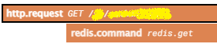

# OpenTelemetry Go DataDog Span Name Formatter

From:


To:



## Description

When using the Go OpenTelemetry instrumentation with DataDog, it uses the instrumentation name as the operation name
(like `go.opentelemetry.io_contrib_instrumentation_github.com_gorilla_mux_otelmux.server`), and tries to guess the
span name for some types of spans (like http) and only uses the real span name if guessing failed.

This results in ugly span names in the DataDog UI, like can be seen on the "From" image above.

This library returns a custom `trace.TracerProvider` instance that can be sent to instrumentations via an option like
`WithTracerProvider`, which wraps the underlying provider and sets the `operation.name` and `resource.name` attributes
that DataDog uses in its UI.

The `contrib` directory contains implementations for common packages following the same naming patterns as
[the official DataDog Go library](https://github.com/DataDog/dd-trace-go).

## Usage

```go

```

## Author

Rangel Reale (rangelreale@gmail.com)
